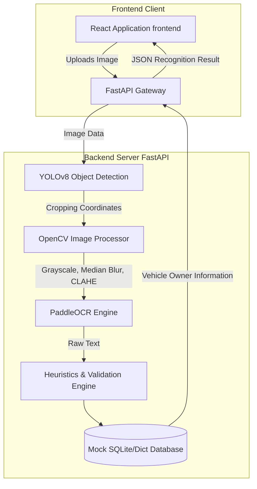

# PlateSense AI

PlateSense AI is an intelligent, high-performance web application designed for automatic license plate detection and character recognition. Built with a modern React frontend and a robust FastAPI backend powered by YOLOv8 and PaddleOCR, PlateSense AI offers accurate, real-time license plate extraction and vehicle owner detail retrieval.

## 🌟 Key Features

- **High-Accuracy License Plate Detection:** Utilizes a custom-trained YOLOv8 model (`license_plate_detector.pt`) for fast and precise localization of Indian license plates in images.
- **Robust Optical Character Recognition (OCR):** Integrates PaddleOCR with advanced image preprocessing techniques (Median Blur, CLAHE contrast enhancement) to ensure maximum text extraction accuracy even under challenging lighting.
- **Heuristic Validation Engine:** Uses an intelligent syntax mapping and heuristic correction engine tailored for specific Indian Number Plate formats (e.g., standard formats, BH series).
- **Responsive Modern UI:** A beautiful frontend built with React, Vite, Tailwind CSS, and shadcn/ui components. Features animations (Framer Motion) and complex layouts (Dashboard, Upload, History).
- **Mock DB Integration:** Simulates fetching real-time vehicle owner details based on the successfully recognized license plate number.

## 🏛️ System Architecture

Below is the high-level architecture diagram demonstrating the full request flow from the client side through the AI detection pipeline:



## 🛠️ Tech Stack

### Frontend
- **Framework:** React 18 with Vite
- **Language:** TypeScript
- **Styling:** Tailwind CSS, `shadcn/ui` for accessible component primitives
- **Routing & State:** React Router DOM v6, React Query (TanStack Query)
- **Animations:** Framer Motion, tailwindcss-animate
- **Icons:** Lucide React

### Backend
- **Framework:** FastAPI (Python)
- **Server:** Uvicorn
- **AI/ML Models:** Ultralytics YOLOv8, PaddlePaddle (PaddleOCR)
- **Image Processing:** OpenCV (cv2), NumPy, Pillow

## 🚀 Getting Started

### Prerequisites

- **Node.js** (v18+)
- **Python** (3.9+)
- npm, yarn, or bun

### 1. Backend Setup

1. Navigate to the `backend` directory:
   ```bash
   cd backend
   ```
2. Create and activate a Python virtual environment:
   ```bash
   python -m venv venv
   source venv/bin/activate  # On Windows use `venv\Scripts\activate`
   ```
3. Install the required Python dependencies:
   ```bash
   pip install -r requirements.txt
   ```
4. Place your trained model file (`license_plate_detector.pt`) inside the `backend` directory.
5. Run the FastAPI development server:
   ```bash
   uvicorn main:app --reload
   ```
   > The API will now be available locally at `http://127.0.0.1:8000`

### 2. Frontend Setup

1. Return to the project root directory (where `package.json` is located):
   ```bash
   npm install
   ```
2. Run the Vite development server:
   ```bash
   npm run dev
   ```
   > The frontend application will be active at the host listed in the terminal (usually `http://localhost:5173`).

## 📡 API Documentation

### `POST /detect`
Uploads an image file for the system to detect and extract the license plate details.

**Request:**
- `Content-Type`: `multipart/form-data`
- Body: `file` (Image upload)

**Response Payload:**
```json
{
  "plate_number": "RJ14CV0002",
  "is_valid_format": true,
  "confidence": 0.92,
  "processing_time": "1.45s",
  "owner_details": { 
     "name": "Jane Smith", 
     "vehicle": "Honda City" 
  },
  "box": [110, 250, 400, 150],
  "image_url": "/processed/xyz.jpg"
}
```

### `GET /health`
A simple health check endpoint that returns the status of the backend API.
```json
{ "status": "ok" }
```

## 🧠 OCR & Preprocessing Pipeline
1. **Localization:** YOLOv8 scans the image and boundary boxes out the highest confidence license plate.
2. **Image Enhancement:** The license plate region is cropped and upscaled 2x. It is then converted into a grayscale format; a Median Blur removes light pepper noise, and a Contrast Limited Adaptive Histogram Equalization (CLAHE) operation heavily enhances contrast, preventing characters bounding light reflections from eroding.
3. **Extraction & Correction:** PaddleOCR extracts text strings from the multi-channel adjusted plate. Following this, an advanced heuristic mapping engine replaces common misclassified characters (e.g. `O` vs `0`, `I` vs `1`) directly correlating with standardized Indian transport number plate layout mapping rules configurations.
